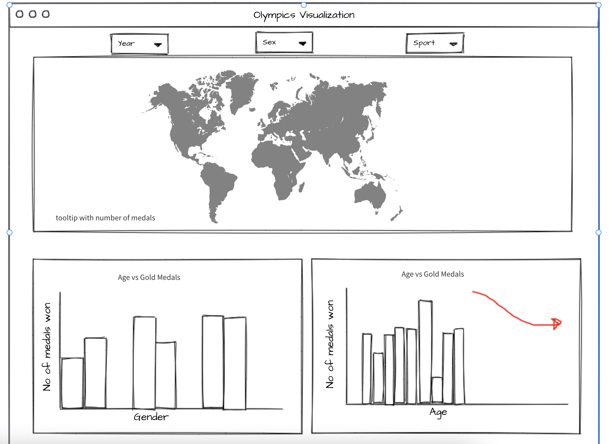

# Olympic Games Analysis Dashboard

An interactive dashboard demonstrating statistics regarding the Summer and Winter Olympic Games from 1896 to 2016.

## Overview

This app aims to make Olympic data accessible and digestible for community members, and potentially inform individuals watching, the expected pattern in the future Olympic games. Our app will show the distribution of factors contributing to gold medals in past Olympic games and will allow users to explore various aspects of this data with ease by filtering and re-ordering on different variables, such as country, geographical location, and sport.

## Description

This app will provide a dashboard that summarizes a few of the key statistics that we have extracted from this data. Specifically, our dashboard aims to provide accessible visuals that demonstrate the differences in biological sex, geographic location, and physical characteristics of athletes and how these factors impact performance within the Olympic Games. Our dashboard will be segregated into 3 tabs: 'Gender Equality', 'Home Field Advantage', and 'Do Physical Attributes Affect Performance?'.

**Gender Equality**

Within the 'Gender Equality' tab, we will provide a line chart in the top right panel to indicate the number of medals received by athletes, color-coded by biological sex. The bottom two panels that accompany the line chart will allow the user to interactively select which country they would like to filter for via a drop-down menu bar. Notably, each panel will interact with the drop-down menu that allows the user to select a country. Other information provided in this tab will demonstrate the number of total medals received and the total number of athletes within the filtered country and a specified year.

**Home Field Advantage**

Within the 'Home Field Advantage' tab, we will allow users to interactively select a year via a drop-down menu bar to view which country hosted the Olympic Games for that specified year, which will be highlighted on a world map. Additionally, this drop-down menu will interact with the other panels to highlight the selected country in those panels. The panel on the right will compare the number of medals received by the selected 'home' country in other Olympic Games and compare this with the number of medals received when hosting the Olympic games. The bottom-left panel will highlight how the number of medals in the home country compares with the number of medals received by other teams for the selected year.

**Physical Attributes**

Finally, the 'Do Physical Attributes Affect Performance? tab will show how physical attributes affect performance in different sports. Moreover, we will allow users to interactively select a year and a sport via 2 drop-down menu bars, and these selections will interact wih each panel presented in this tab. We will use a pie chart to demonstrate the proportion of medals received by different height categories. We will also use a histogram and a scatterplot to show the effects of age and weight on the number of medals received, respectively.

## Contributing

This app is authored by Kiran Phaterpekar, Karanpreet Kaur, Sanchit Singh, Lakshmi Santosha Valli Akella. You can see the list of all contributors in the contributors tab.

We welcome and recognize all contributions. If you wish to participate, please review our [Contributing guidelines](CONTRIBUTING.md)

## License

The app is licensed under the terms of the MIT license.
